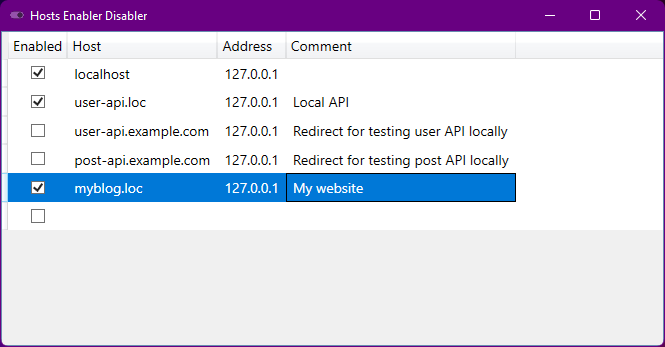

# Host Enabler Disabler

A small app that makes it easy to manage hosts in Windows hosts file.

It allows you to enable, disable, edit, add and delete hosts.

It is useful when debugging web applications locally.

